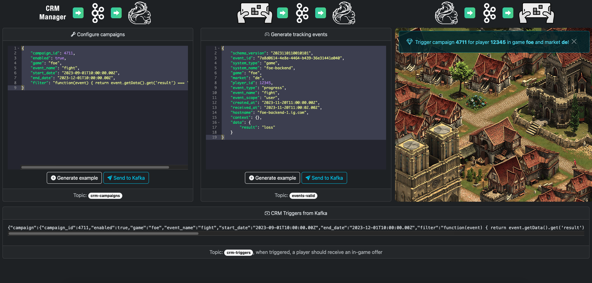

# Real-time Customer Engagement in Gaming Using Kafka and Flink

## Description
Demo Flink project to show how to react on interaction events in real-time and trigger CRM campaigns for customer
engagement based on campaign configurations.

The project also utilizes the [Broadcast State Pattern](https://nightlies.apache.org/flink/flink-docs-release-1.18/docs/dev/datastream/fault-tolerance/broadcast_state/) 
in order to update the rules (_campaigns_) at runtime without restarting the project, using a dedicated, low-frequency, Kafka topic.

## Business Logic

### Customer Engagement Campaigns
Each customer engagement campaign runs for a specific product (game) and can have a start and end date.
Additionally, a campaign can be enabled and disabled and has a unique ID.

The key element of a campaign is the filter. The filter is a JavaScript function that is executed for each event and
must return a boolean value. With this filter, we can define the conditions that must be met in order to trigger the
campaign based on an event.

Campaigns can be configured by simply writing the JSON representation to the `crm-campaigns` Kafka topic.

### Trigger Campaigns
Interaction events are written as JSON to the `events-valid` Kafka topic. For each event, the Flink Application will
evaluate all active campaigns and check if the filter matches. If that is the case, a trigger is written to the
`crm-triggers` Kafka topic, indicating that the user is eligible to receive the offer connected to the campaign.

Please refer to the local execution example to get a better understanding of how the system works.

## Local Execution
Requirements:
* Docker
* (_optional_) kcat (see: https://github.com/edenhill/kcat)

### Configuration
Default configuration is defined in `src/main/resources/config.json`. You can override it by creating a
custom config file and pass the path as a parameter named `config` when running the Flink job.

### Start Kafka
Just run the following command in the project dir to start ZooKeeper and Kafka as defined in `docker-compose.yml`:
```bash
docker-compose up -d
```

### Create topics
We are using `kcat` to interact with Kafka. We start the producer and exit (CTRL+D) again to just create the
necessary topics:
```bash
kcat -b localhost:9093 -t events-valid -P
kcat -b localhost:9093 -t crm-campaigns -P
kcat -b localhost:9093 -t crm-triggers -P
```

Then use `kcat` to list topics:
```bash
kcat -b localhost:9093 -L | grep topic
```

The output should include the three topics above:
```
Metadata for all topics (from broker 1: localhost:9093/1):
 4 topics:
  topic "crm-triggers" with 1 partitions:
  topic "events-valid" with 1 partitions:
  topic "crm-campaigns" with 1 partitions:
  topic "__consumer_offsets" with 50 partitions:
```

### Run Flink job
Run `com.innogames.analytics.rtcrm.App` and use `kcat` to create a campaign, send and event and check the trigger:

### Open Flink Web UI
Open http://localhost:8081/ to see the Flink Web UI.

### Create campaign
```bash
kcat -b localhost:9093 -t crm-campaigns -P
```
```
{"campaign_id":4711,"enabled":true,"game":"foe","event_name":"fight","start_date":"2023-09-01T10:00:00.00Z","end_date":"2023-12-01T10:00:00.00Z","filter":"function(event) { return event.getData().get('result') === 'loss' }"}
```

### Send event
```bash
kcat -b localhost:9093 -t events-valid -P
```
```
{"schema_version":"2023110110010101","event_id":"7a8d0614-4e8e-4464-b439-36e31441a040","system_type":"game","system_name":"foe-backend","game":"foe","market":"de","player_id":12345,"event_type":"progress","event_name":"fight","event_scope":"user","created_at":"2023-11-20T11:00:00.00Z","received_at":"2023-11-20T11:00:02.00Z","hostname":"foe-backend-1.ig.com","context":{},"data":{"result":"loss"}}
```

### Consume trigger
```bash
kcat -b localhost:9093 -t crm-triggers -C -o beginning -u
```

## Demo UI



When Kafka and Flink are running, you can also use the dedicated `flink-real-time-crm-ui` Demo UI project in order to
interact with the system via a web frontend.
